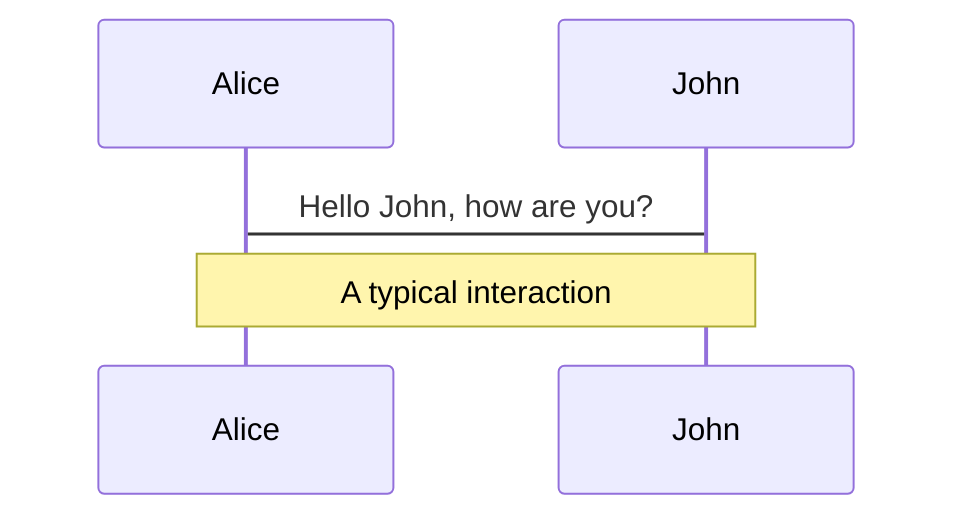

# Slidev はいいぞ

2024-02-15 社内 LT 大会

<p class="absolute bottom-10 right-10 font-700">
  mitani24
</p>

---
layout: two-cols
---

# [Slidev](https://sli.dev/) とは

- テキストベースのスライド作成するツール
  - SPA として出力される
  - このスライドも Slidev で作られている
- 類似ツール
  - [Marp](https://marp.app/)
  - [Fusuma](https://hiroppy.github.io/fusuma/)

::right::


---

# 準備はかんたん！

- 必要なもの
  - Node.js
  - テキストエディタ
- `npm init slidev@latest` コマンド1発で環境が整う
- 生成された `slides.md` を編集するだけ

<!-- <Asciinema src="slidev-init.cast" :playerProps="{cols: 150, rows: 25, speed: 2}" m="t-4"/> -->

---

# スライドを記述する

<div grid="~ cols-2 gap-8">
<div>

Input

```md {all|1-5|9-16|17|all}
---
theme: seriph
background: https://source.unsplash.com/collection/94734566/1920x1080
transition: slide-left
---

<!-- 1ページ目 -->

# Slidev はいいぞ

2024-02-15 社内 LT 大会

<p class="absolute bottom-10 right-10 font-700">
  mitani24
</p>

---

<!-- 2ページ目 -->
```

</div>
<div>

Output


</div>
</div>


---
layout: statement
---

# 特長1: 高すぎる表現力

---

# 高すぎる表現力: コードブロック

行ハイライトや TypeScript の型情報付きのコードブロックを使える

<div grid="~ cols-2 gap-8">

```ts {all|2|1-6|9|all}
interface User {
  id: number
  firstName: string
  lastName: string
  role: string
}

function updateUser(id: number, update: User) {
  const user = getUser(id)
  const newUser = { ...user, ...update }
  saveUser(id, newUser)
}
```

```ts twoslash
interface User {
  id: number
  firstName: string
  lastName: string
  role: string
}

function updateUser(id: number, update: User) {
  const user = getUser(id)
  const newUser = { ...user, ...update }
  saveUser(id, newUser)
}
```

</div>

---

# 高すぎる表現力: Monaco Editor

スライドの中で自動補完付きのライブコーディング

```ts {monaco}
interface User {
  id: number
  firstName: string
  lastName: string
  role: string
}

function updateUser(id: number, update: User) {
  const user = getUser(id)
  const newUser = { ...user, ...update }
  saveUser(id, newUser)
}
```

---

# 高すぎる表現力: 数式・ダイアグラム

LaTeX や Mermaid はもちろんいける

<div grid="~ cols-2 gap-8">

$$
\begin{array}{c}
\nabla \times \vec{\mathbf{B}} -\, \frac1c\, \frac{\partial\vec{\mathbf{E}}}{\partial t} &
= \frac{4\pi}{c}\vec{\mathbf{j}}    \nabla \cdot \vec{\mathbf{E}} & = 4 \pi \rho \\
\nabla \times \vec{\mathbf{E}}\, +\, \frac1c\, \frac{\partial\vec{\mathbf{B}}}{\partial t} & = \vec{\mathbf{0}} \\
\nabla \cdot \vec{\mathbf{B}} & = 0
\end{array}
$$




</div>

---

# 高すぎる表現力: video, iframe, ...

埋め込めます。それ

<div grid="~ cols-2 gap-8">
<video src="video.mov" autoplay loop muted />
<iframe src="https://www.google.com/maps/embed?pb=!1m18!1m12!1m3!1d3240.82803068985!2d139.7645498765545!3d35.681236172587326!2m3!1f0!2f0!3f0!3m2!1i1024!2i768!4f13.1!3m3!1m2!1s0x60188bfbd89f700b%3A0x277c49ba34ed38!2z5p2x5Lqs6aeF!5e0!3m2!1sja!2sjp!4v1707909133619!5m2!1sja!2sjp" width="400" height="300" style="border:0;" allowfullscreen="" loading="lazy" referrerpolicy="no-referrer-when-downgrade"></iframe>
</div>

---

# 高すぎる表現力: Vue Component

なんでもできるやん…

<div grid="~ cols-2 gap-8" m="t-4">
<div>

自作の Vue Component を埋め込める

```html
<Counter :count="10" />
```

<Counter :count="10" m="t-4" />
</div>
<div>

便利な Built-in Component も用意されている

```html
<Tweet id="1390115482657726468" />
```

<Tweet id="1390115482657726468" scale="0.5" />
</div>

</div>

---

# 高すぎる表現力: 他にもいろいろ

紹介しきれん…

- テーマ
- アニメーション
- アイコン
- スライドトランジション
- レイアウト
- アドオン
- etc.

多くの機能がカスタマイズ可能で拡張に対して開かれまくっている

---
layout: statement
---

# 特長2: プレゼンを上手くやれる

---

# 最高のプレゼンツール

作るだけじゃない

- ページ一覧
- 勝手に付いてくる Light / Dark モード
- カメラビューをスライド上に表示
- プレゼンテーションを録画
- ドローイングツール
- プレゼンターモード
- ローカルファイルと同期した統合エディタ


---

# いいところ😊

- 素早く映えるスライドを作れる
- コンテンツとスタイルを分離できる
  - まずコンテンツに集中、後からスタイルを調整する進め方ができる
- 技術的な内容との親和性が高い
- 表現力が高い
  - Web 技術を用いたリッチな表現が可能
- 拡張性が高い
  - 多くの機能が拡張できる
  - theme, addon が npm packages として公開されている
    - このスライドも [slidev-addon-asciinema](https://www.npmjs.com/package/slidev-addon-asciinema) を使用させていただいた
- バージョン管理しやすい

---

# あと一歩なところ😢

- ある程度お作法への慣れが必要
- 凝ったことをやろうとすると途端にハードルが上がる
  - [UnoCSS](https://unocss.dev/), [@vueuse/motion](https://motion.vueuse.org/) 等の知識が要求される
- 凝ろうと思えばいくらでも凝れるのでやらないことを決めないと凝り続けてしまう
- たまに怪しい挙動がある
  - たぶんまだ Beta 版
- 日本語ドキュメントも用意されているが若干古い
  - 英語版を見たほうがいい

---
layout: cover
background: https://source.unsplash.com/qaCJ6A0Rfvg
---

# Slidev はいいぞ
