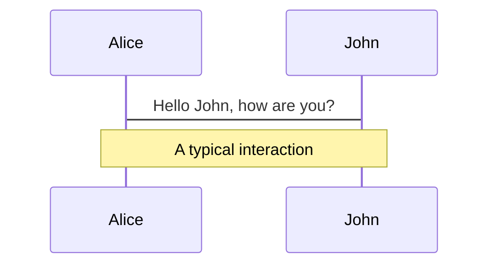

# Slidev はいいぞ

2024-02-15 社内 LT 大会

<p class="absolute bottom-10 right-10 font-700">
  mitani24
</p>

---
layout: two-cols
---

# [Slidev](https://sli.dev/) とは

- テキストベースのスライド作成ツール
- いくつかのパッケージ群で構成される
  - CLI
  - theme などの npm packages
  - VSCode 拡張機能

このスライドも Slidev で作られている

::right::


<!-- 
LT 大会開催されるということでスライド作る機会が増えると思ったので一例として紹介します
-->

---
layout: statement
---

# 特長1: テキストベース

---

# 特長1: テキストベース

主に Markdown でスライドを記述する

<div grid="~ cols-2 gap-8">
<div>

Input

```md {all|1-4|6-12|14|all}
---
theme: seriph
transition: slide-left
---

# Slidev はいいぞ

2024-02-15 社内 LT 大会

<p class="absolute bottom-10 right-10 font-700">
  mitani24
</p>

---

<!-- 2ページ目 -->
```

</div>
<div>

<p m="t-0">Output</p>


</div>
</div>

<style>
p {
  @apply mt-0!;
}
</style>

<!--
YAML 形式でテーマやオプションなどのメタ情報を記述する
コンテンツは Markdown で書いて、場合によっては HTML 要素を直接書くこともできる
トリプルダッシュで改ページ

右のようにスライドが出力される
ここでは1ページ目なので自動で背景やセンタリングのタイトル向けレイアウトがテーマによって適用される
-->

---

# 特長1: テキストベース

## 利点

- 素早く映えるスライドを作れる
- コンテンツとスタイルを分離できる
- 再利用性が高い
- バージョン管理しやすい

<style>
h2 {
  @apply my-4!;
}
</style>

<!--
- 素早く映えるスライドを作れる
  - 公式のテーマを使うだけで割と小洒落た見た目になる
- コンテンツとスタイルを分離できる
  - まずコンテンツに集中、後からスタイルを調整する進め方ができる
- 再利用性が高い
  - 過去に作ったスライドからコピペとかが簡単
- Git と相性がよくバージョン管理しやすい
-->

---
layout: statement
---

# 特長2: SPA として出力する

---

# 特長2: SPA として出力する

- 見た目がスライドっぽい Web アプリ
- スライド作成やプレゼンテーションは開発サーバーを起動して行う

## 利点

- コードの変更は即座にスライドに反映
- [GitHub Pages](https://pages.github.com/) など好きな場所にホストして公開できる

<style>
h2 {
  @apply mb-4!;
}
</style>

<!--
他のツールは「プレゼンテーションを開始」などで専用の画面が立ち上がる
Slidev は単に見た目がスライドっぽい Web アプリとして出力される
スライド作成やプレゼンテーションは開発サーバーを起動して行う
-->

---
layout: statement
---

# 特長3: 高すぎる表現力

---

# 高すぎる表現力: コードブロック

行ハイライトや TypeScript の型情報付きのコードブロックを使える

<div grid="~ cols-2 gap-8">

```ts {all|2|1-6|9|all}
interface User {
  id: number
  firstName: string
  lastName: string
  role: string
}

function updateUser(id: number, update: User) {
  const user = getUser(id)
  const newUser = { ...user, ...update }
  saveUser(id, newUser)
}
```

```ts twoslash
interface User {
  id: number
  firstName: string
  lastName: string
  role: string
}

function updateUser(id: number, update: User) {
  const user = getUser(id)
  const newUser = { ...user, ...update }
  saveUser(id, newUser)
}
```

</div>

<!-- 
特にエンジニアの方はスライド中にコードを載せることがある
単にコードブロックを表示できるだけじゃなく、行ハイライトができるのでこの部分がこうだよというのが説明しやすい

TypeScript ではホバーすると型情報が見える機能を追加できる
-->

---

# 高すぎる表現力: Monaco Editor

スライドの中で自動補完付きのライブコーディング

```ts {monaco}
interface User {
  id: number
  firstName: string
  lastName: string
  role: string
}

function updateUser(id: number, update: User) {
  const user = getUser(id)
  const newUser = { ...user, ...update }
  saveUser(id, newUser)
}
```

---

# 高すぎる表現力: 数式・ダイアグラム

LaTeX や Mermaid はもちろん使える

<div grid="~ cols-2 gap-8">

$$
\begin{array}{c}
\nabla \times \vec{\mathbf{B}} -\, \frac1c\, \frac{\partial\vec{\mathbf{E}}}{\partial t} &
= \frac{4\pi}{c}\vec{\mathbf{j}}    \nabla \cdot \vec{\mathbf{E}} & = 4 \pi \rho \\
\nabla \times \vec{\mathbf{E}}\, +\, \frac1c\, \frac{\partial\vec{\mathbf{B}}}{\partial t} & = \vec{\mathbf{0}} \\
\nabla \cdot \vec{\mathbf{B}} & = 0
\end{array}
$$




</div>

---

# 高すぎる表現力: video, iframe, ...

埋め込めます。それ

<div grid="~ cols-2 gap-8">
<video src="/video.mov" autoplay loop muted />
<iframe src="https://www.google.com/maps/embed?pb=!1m18!1m12!1m3!1d3240.82803068985!2d139.7645498765545!3d35.681236172587326!2m3!1f0!2f0!3f0!3m2!1i1024!2i768!4f13.1!3m3!1m2!1s0x60188bfbd89f700b%3A0x277c49ba34ed38!2z5p2x5Lqs6aeF!5e0!3m2!1sja!2sjp!4v1707909133619!5m2!1sja!2sjp" width="400" height="300" style="border:0;" allowfullscreen="" loading="lazy" referrerpolicy="no-referrer-when-downgrade"></iframe>
</div>

<!--
Web なので video 要素で動画を埋め込んだり iframe を埋め込んだりとかが簡単にできる
-->

---

# 高すぎる表現力: Vue Component

なんでもできるやん…

<div grid="~ cols-2 gap-8" m="t-4">
<div>

自作 Vue Component を埋め込める

```html
<Counter :count="10" />
```

<Counter :count="10" m="t-4" />
</div>
<div>

便利な Built-in Component も用意されている

```html
<Tweet id="1390115482657726468" />
```

<Tweet id="1390115482657726468" scale="0.5" />
</div>

</div>

<!--
Vue Component も埋め込める

この例ではカウンター Component を埋め込んでスライド内で動かせる
組み込みの便利な Component も用意されていて、ツイートを埋め込んだり、矢印を引いたりのよく使う表現が簡単に利用できる
-->

---

# 高すぎる表現力

## 利点

- Web でできることは Slidev でも実現可能
- 多様な表現を Markdown 内で簡単に扱えるよう工夫されている
- 技術的な内容と親和性が高い
- Web のエコシステムを活用できる

<style>
h2 {
  @apply mb-4!;
}
</style>

<!-- 
- Web でできることは Slidev でも実現可能
  - アイデア次第でオリジナリティのあるプレゼンができる
- 多様な表現を Markdown 内で簡単に扱えるよう工夫されている
- 技術的な内容と親和性が高い
- Web のエコシステムを活用して機能を追加できる
-->

---
layout: statement
---

# あと一歩なところ

---

# あと一歩なところ

- ある程度お作法への慣れは必要
- 凝ったことをやろうとすると途端にハードルが上がる
  - [UnoCSS](https://unocss.dev/), [@vueuse/motion](https://motion.vueuse.org/) 等の知識が要求される
- 凝り続けて時間が溶ける
- まだ Beta 版
  - たまに怪しい挙動がある
- 日本語ドキュメントも用意されているが若干古い
  - 英語版を見るべし

<!-- 
- ある程度お作法への慣れは必要
- 凝ったことをやろうとすると途端にハードルが上がる
  - 凝ったレイアウトにしようとしたり、アニメーションとかつけようと思うと調べなきゃわからないことがある
- できることが多すぎるので、やらないことを決めないと凝り続けて時間が溶ける
- まだ Beta 版なのでたまに怪しい挙動がある
- 日本語ドキュメントも用意されているが若干古い
  - 英語版を見るべし
-->

---

# まとめ

- Slidev はテキストベースのスライド作成ツール
- Web 技術がベースとなっている
- 高い表現力とそれを扱いやすくする工夫がたくさん
- 使い手は選ぶが使いこなせれば強力

---
layout: cover
background: https://source.unsplash.com/qaCJ6A0Rfvg
---

# Slidev はいいぞ
